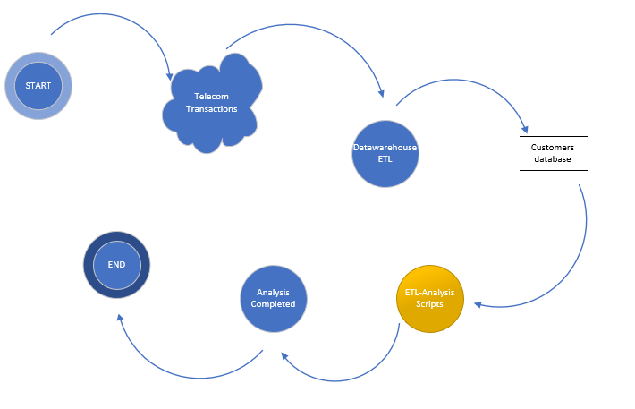

# ETL & Analysis with python and batch
This repository is about a set of scripts performing some ETL and Basic Data analysis with the help of python scripts launched through batch file.
The below scenario is given as an initial motivation for this script

## How to run
Download or clone the repository then edit your required parameters and functionalities in the batch and other python scripts

## Requirements to run
This project was built using python 2 and SQLite
